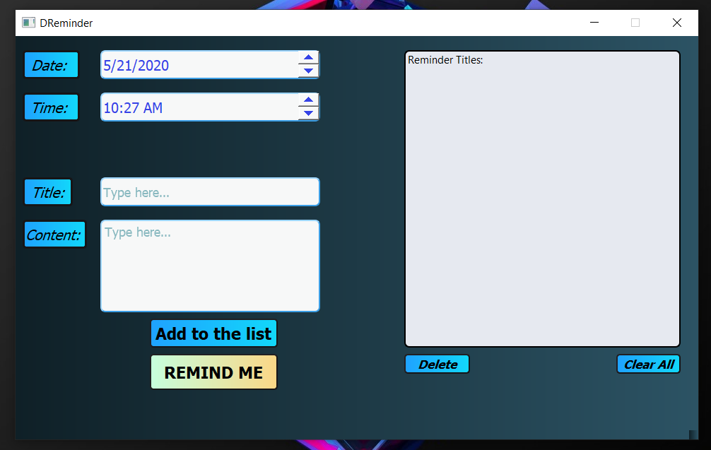
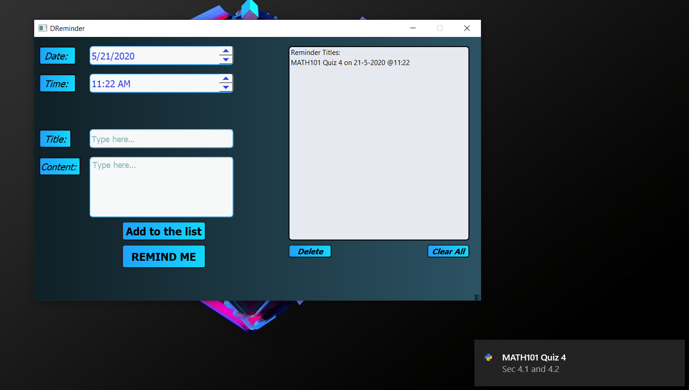

# DReminder
  
  
  
## Description
  DReminder is an application that shows desktop toast notification on specified time/date. This can be used as a reminder
  about anything that you (the user) want. Moreover, you can run this application as a background process using the task manager
  or by using **subprocess** python module.
  
## Screenshots Of The Application



## How To Create A .exe File?
Download this repository and create a virtual environment folder in the **cmd** using the command ````python -m venv venv````. Activate this venv using the command ````venv\Scripts\activate.bat```` and then install the following modules/packages:
````
pip install PyQt5
pip install win10toast
pip install typing-extensions
pip install cx-Freeze
````
>**Note:** ***venv** should be created in this repo.*

*Now follow these steps*

Step 1: Run the scripts to check if they are working properly.

Step 2: Create a new module **setup.py** and copy paste the following code (and save it in the **src** folder):

````markdown
import sys
from cx_Freeze import setup, Executable

setup(name='DReminder',
      version='1.0',
      description='An application that sends toast notifications on desktop.',
      executables=[Executable('mainUiLogic.py', base='Win32GUI')])
````
Step 3: Go to **venv->Lib->sit-packages** and copy paste all the packages in the **src** folder. This is because cx-Freeze module sometimes gives error if you do not do this step.

Step 4: Go to **src** and open **cmd**. Type the following command:
````markdown
python setup.py build
````
After this you will be able to see **build** folder in **src**. 

Step 5: Now in **src** folder, go to **build->exe.win32-3.6** and you will be able to see **mainUiLogic.exe**.
Now you can click on this .exe file or create a shortcut and give it 
any name you want.

Final step: Enjoy the app! Now you can use this app as a desktop reminder.

>**Note:** *If you get any errors, then try looking at YouTube videos on how to use **cx_Freeze** module.*

