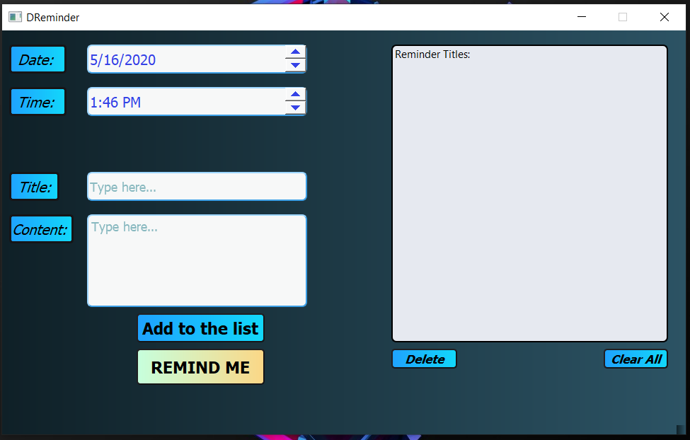
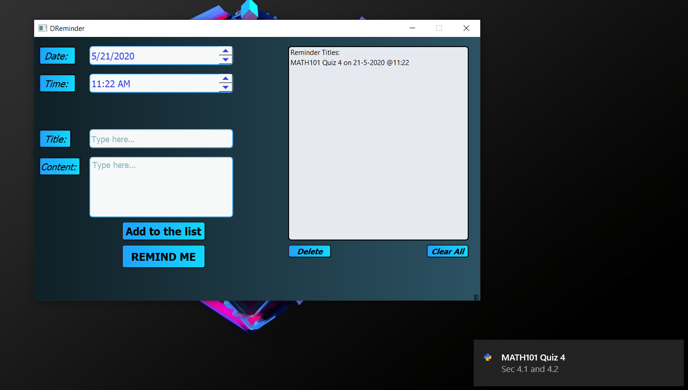

# DReminder
  
## Description
  DReminder is an application that shows desktop toast notification on specified time/date. This can be used as a reminder
  about anything that you (the user) want. Moreover, you can run this application as a background process using task manager
  or by using [subprocess] python module.
  
## Screenshots of the application

## How to create a .exe file?
You can use **cx_feeeze** python module for creating a .exe file. For more info, check YouTube tutorials.

